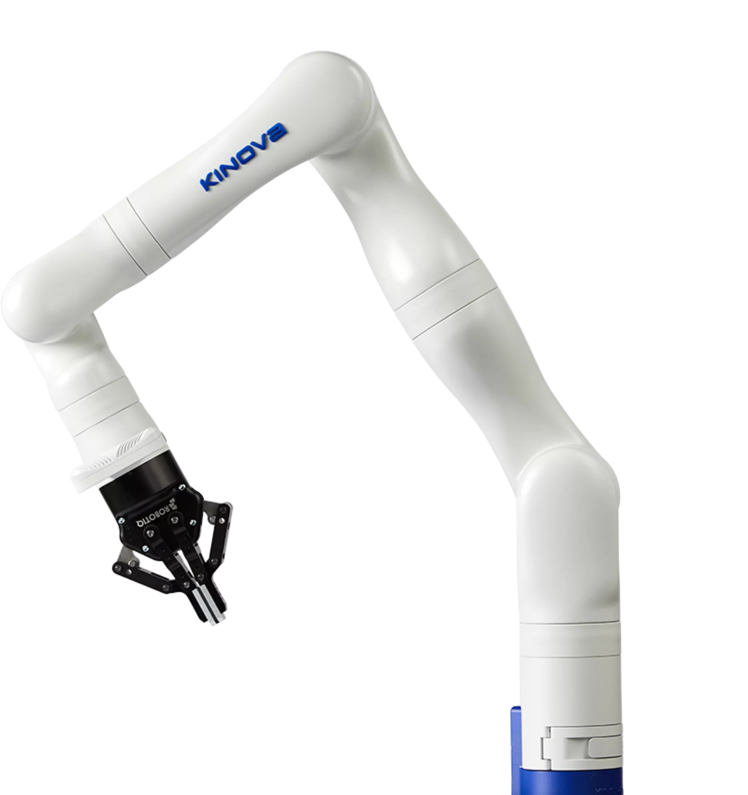
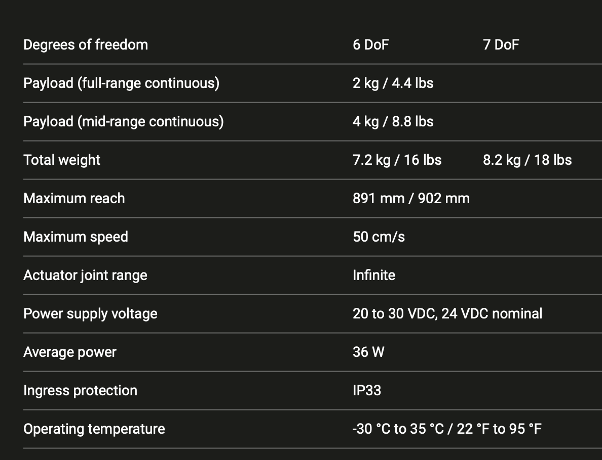

# kinova-ws
Test workspace for KinoGen3 6 dof ins ros2 (humble). Gazebo Simulation and Rviz2 test. Allows quick setup and algorithm testing for serial manipulator.

### Environment configuration 
Personal recommendtaion to use Robostack setup for conda environments. This allow to use ROS2, Gazebo and related toolsets in any OS. This repo was made in MAC Monterey 11.6.2 for ROS humble

Quickstart guide on Robostack: https://robostack.github.io


> Although using classic ROS2 binary installation is useful as well. Robostack is worth trying setup. 
## Requirements  
Minimum requirements
* ROS2 Humble Haksill [https://docs.ros.org/en/humble/index.html]
* Classic Gazebo 11.14 -> TO DO: Change to Ignition Gazebo


## Quickstart Guide 
First clone the workspace kinova_ws
```
git clone https://github.com/mora200217/kinova-ws.git
cd kinova-ws
```
Assuming colcon tools are set, build the environment. Build and source the workspace

```
colcon build --symlink-install
cd install && source setup.zsh && cd ..
```

## Worspace Structure 
The workspace contains two packages: 
* __robot_description__ : Contains de descriptions, `rviz2` config and related files to vizualize and use the robot. 
* __robot_gazebo__ : All configuration needed to run a simple simulation in `Classic Gazebo` with the `robot_description` package. 


# The Robot 
All the workspace is based in the Kinova Gen 3 6 DOF serial manipulator model. 

 
